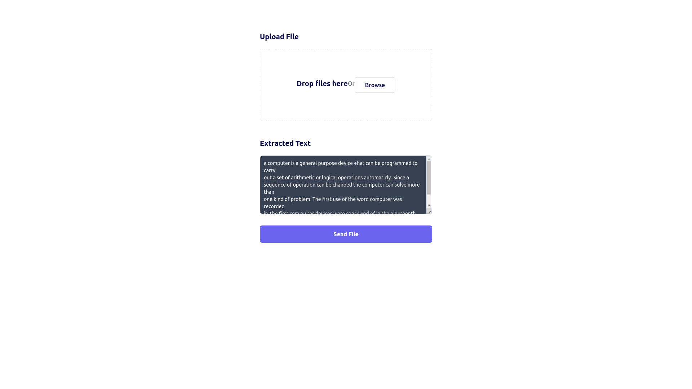
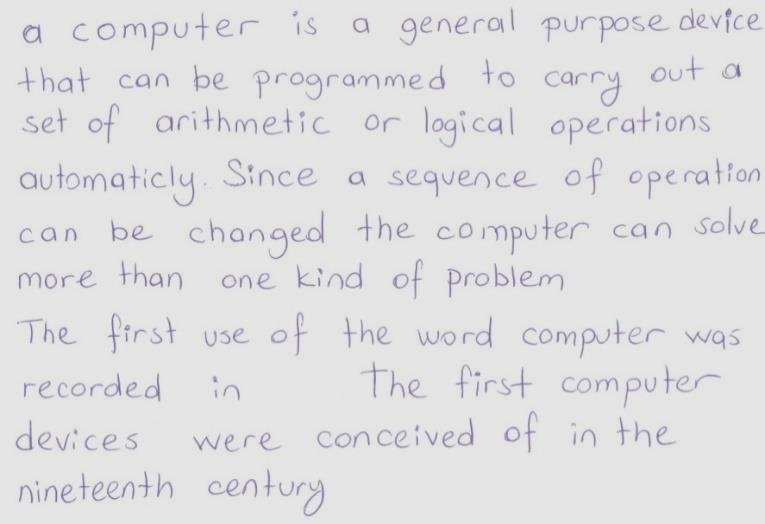

# OCR with FASTAPI

##### A fastapi project that implements an ocr application with tesseract.

* ##### Used:
    * fastapi
    * pytesseract
    * docker
    * precommit_hooks
    * jinja

***

```python
uvicorn src.main:app
```


***

### Input image



### Output Text
```text
a computer is a general purpose device +hat can be programmed to carry
out a set of arithmetic or logical operations automaticly. Since a
sequence of operation can be chanoed the computer can solve more than
one kind of problem  The first use of the word computer was recorded
in The first com pu ter devices were conceived of in the nineteenth
century
```